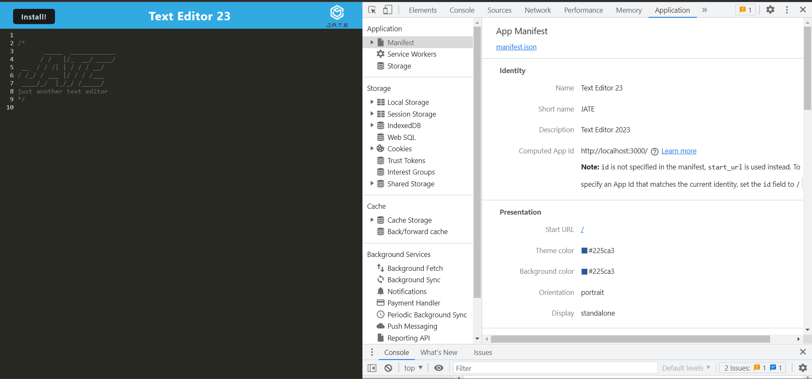
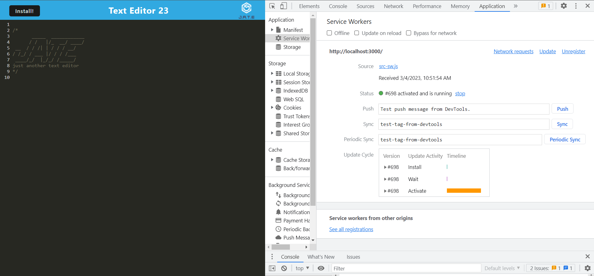
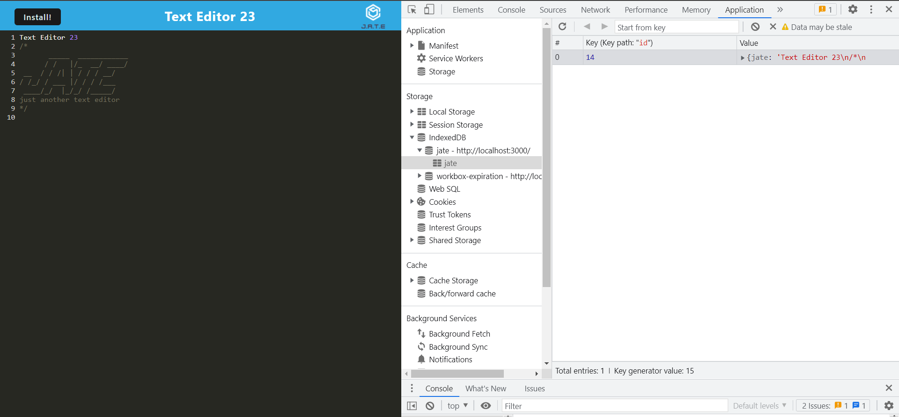

# Text Editor 23

   
  ## Table of Contents
  - [Description](#description)
  - [Installation](#installation)
  - [Usage](#usage)
  - [Questions](#Questions)
  

  ## Description
  🔍This application takes an existing text editor app and makes it work offline as a PWA. This application is deployed through Heroku.
  
  ## Installation
  💾 Run `npm install` in order to install the following npm package dependencies.   
  💾 Run `npm start dev` in order to run the app in localhost.     

  
  ## Usage

  💻  Application's `manifest.json` file:
    

  
  💻  Application registered service worker:
    

  💻  Application's IndexedDB storage:
    

  💻  Install/Uninstall:                                    
     
 

  💻  Heroku: [heroku]() 
    

  ## License 
  
    
     
  ## Questions
  ✋ Feel free to contact me for any questions: 
  
  ✉️ Email me with any questions: [alkida.vaci@gmail.com](alkida.vaci@gmail.com) 
  :octocat: Find me on GitHub: [alkidavaci](https://github.com/alkidavaci)